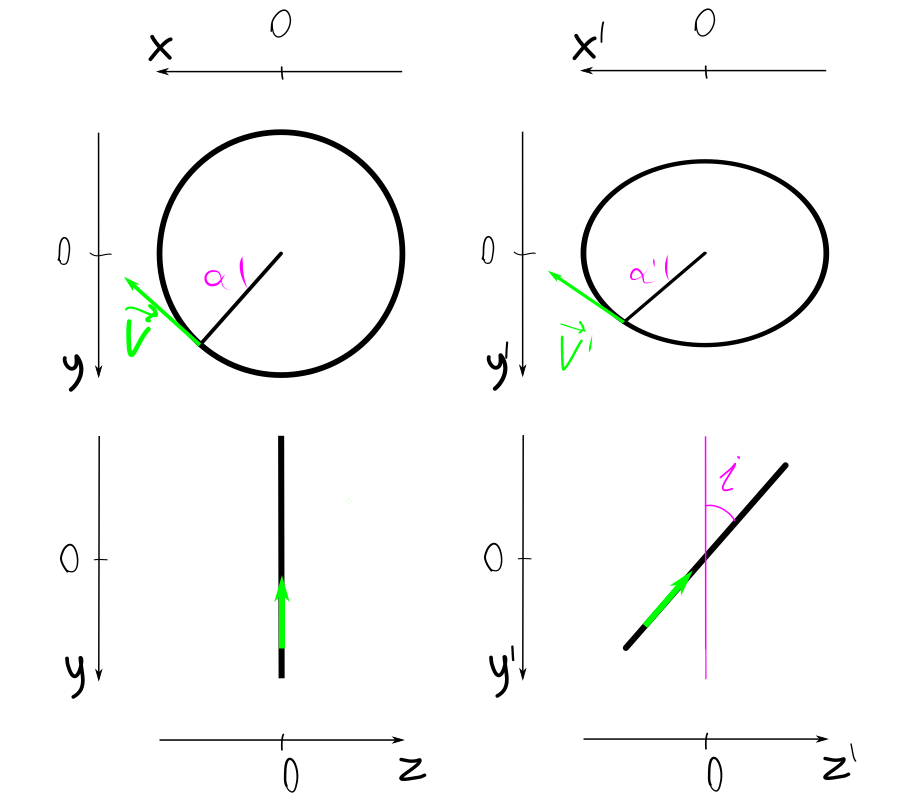

# los_to_rc
GUI for calculating rotation curves of galaxies or analyzing non-circular motions using known line-of-sight velocities.

## Capabilities
 - Calculation of the rotation curve using measured line-of-sight velocities with the known positions of those measurements
 - Plot the position where the velocities are measured on the galaxy image
 - Change the assumed kinematic parameters to see how the resulting rotation curve changes
 - Work with different types of measurements (long slit, IFU, or other) as long as the data is presented in the supported format
 - Combine information from different observations and instruments
 - Delete points that seem to be outliers
 - Save results as csv files or images

## Installation
Currently, this software was only been tested on Linux systems and Python 3.10.

First of all, you need to install the necessary packages:
 - numpy
 - scipy
 - matplotlib
 - pandas
 - astropy
 - PySide6

You can do it in any way you prefer, or use the command:

`pip install numpy scipy matplotlib pandas astropy PySide6`

Then you can clone this repository in any folder and make the main script executable:

```
git clone https://github.com/CosmicHitchhiker/los_to_rc.git
cd los_to_rc
chmod a+x los_to_rc.py
```

## Usage

 <p align="center">
  
</p>

### Preparation

To use this program you need to prepare a CSV file with the measured line of sight
velocities and coordinates of points at which those velocities were measured.
The CSV file should contain the following columns:

 - _velocity_ : measured line of sight velocity (km/s)
 - _RA_ : Right Accession of every point (HH:MM:SS.SS - hour angle)
 - _DEC_ : Declination of every point (DD:MM:SS.SS - degrees)
 - _velocity_err_ : velocity error (km/s), OPTIONAL

You also should prepare a FITS file with a galaxy image and correct WCS keywords in its header.

### Executing the program
Run the script from the folder where it is located:
`./los_to_rc.py`

It is also possible to preset some input parameters in the terminal. For more information type:
`./los_to_rc.py -h`

### Setting the initial parameters

First of all, you need to open the csv file (or files) with your data.
Click **Manage CSV files** and add your files by clicking the **+** button and choosing the file.
You should do it for every file separately.
The files will appear in the table as rows with the next parameters:
 - *Path* - full path of the file
 - *Color 1* and *Color 2* - colors that are used to plot the data points from this file.
There are two slightly different colors to plot points of the same galactocentric distance
on the different sides of a galaxy.
 - *Label* - label name that will be used in the plot legend (you should set it manually)

Then you need to add an image of the galaxy.
It should be in the FITS format with the correct WCS keys in the header.
Click on the folder icon in the **image** field and choose the fits file.
Alternatively, you can input the full path of the image in the **image** field directly.

Now you may fill in all other fields at the bottom of the window.
 - **i** : inclination angle (degrees), an angle between the picture plane and the plane of a galaxy disc.
 - **PA** : position angle of the major axis of a galaxy (degrees).
 In case of negative circular velocity values, you should add or subtract 180 to the value of PA.
 - **RA** : Right Acession of the center of a galaxy (hour angle).
 - **DEC** : Declination of the center of a galaxy (degrees).
 - **System velocity** : line of sight velocity of the center of a galaxy (km/s).
 - **Distance**: a distance to the galaxy (Mpc). You can check the *calculate from velocity* checkbox to
 calculate distance using formulae: D = V/70, where D is the distance, V is the system velocity
 and 70 km/s/Mpc is the Hubble constant.

After that, you can push the **Redraw** button to process the data, plot the calculated rotation curve and
the image of a galaxy with the points of measurement.
Note that every time you change the list of input csv files or the
image file, you should click this **Redraw** button.

### Images

The results of the calculation are shown in the left plot. It is the V(R) graph calculated in the assumption of
the circular motion. Data from different files is plotted in different colors, the errorbars show the calculated error
in the resulting "rotation curves". It is possible to clear the plot of outliers.
Click with the right mouse button on the point to select it for deleting. Then click the right mouse button one more time
to confirm deletion or the left mouse button to cancel selection.

The right plot is the image of the galaxy. Color dots show the position of the corresponding points from the left plot.
The red cross marks the center of the galaxy set in the input fields. The yellow ellipses show the points at
5, 10, 15, and 20kpc radii from the adopted center of the galaxy.

Above each plot, there is a toolset to zoom, move, or save the plot. The "Home" pictogram will return the initial view of the
plot, "Cross with arrows" will allow you to drag the image, "Lense" is to select and zoom some region of an image,
"Floppy disk" allows you to choose the destination folder and save the image in the desired format.


### Changing parameters

Now you may want to change some of the galaxy's kinematic parameters. To do so, you should click on the parameter field,
insert it manually or change its value using arrows on the right side of its value.
Alternatively, you can use the keyboard `Up` and `Down` keys to increase/decrease values.
`Up+Ctrl` or `Down+Ctrl` will increase/decrease value by the default step multiplied by 10.

##### Fine movements

Sometimes it is more convenient to change the position of the center of the galaxy using all 4 keyboard arrow keys,
moving it up, down, left, and right. To do so, follow these steps:
 - Click **Fine movements** button
 - Set the desired steps along the RA and DEC axes
 - Click the **Move** button (it will remain clicked)
 - Use arrows to navigate the image

You can also change the movement direction by checking the **Move along PA** checkbox.
In this case up/down movement will be considered as movements along the set PA of the galaxy,
and left/right movements will go perpendicular to the PA.


### Saving results
If you need to save the results in a csv format, you can push the *Save Results* button. A separate
dialog to save file will be opened for each CSV file from the *csv* field. The resulting
file is also a CSV file. It contains the following columns:
 - _RA_ : Right Accession of every point (HH:MM:SS.SS - hour angle)
 - _DEC_ : Declination of every point (DD:MM:SS.SS - degrees)
 - _Circular_v_ : velocity of every point relative to the center of a galaxy assuming
 circular motion (km/s)
 - _Circular_v_err_ : error of circular_v (km/s)
 - _R_pc_ : distance from every point to the center of a galaxy, corrected by inclination angle (pc)
 - _R_arcsec_ : distance from every point to the center of a galaxy, corrected by inclination angle (arcsec)
 - _mask1_ and _mask2_ : boolean values. _mask1_ is True if the point is on one side of the galaxy's minor axis
 and _mask2_ is True if it is on the other side. There may be some points that have both _mask1_ and _mask2_ values False.
 That means that either circular_v_err is too big (>200km/s) or the point was deleted on the csv plot.

 ## Algorithm of the calculations

 ### Coordinates definition

 <p align="center">
  
</p>

 I define the *observed* three-dimensional cartesian coordinate system with the center in the galaxy center:
  - x'-axis matches the major axis
  - y'-axis matches the minor axis
  - z'-axis matches the line of sight

Then I define the *galaxy* coordinate system, in which I take into account the inclination (*i*) of the
galaxy plane to the picture plane:
 - x-axis still matches the major axis ($x = x'$)
 - y-axis matches the minor axis, but the y-coordinate stretches due to the inclination of
  the galaxy ($y = y' / \cos{i}$)
 - z-axis matches the line of sight, but the z-coordinate also stretches ($z = z' / \sin{i}$)

Let's consider a point in the galaxy plane at the distance R from the center of the galaxy with an angle between
its radius-vector and the x-axis (in the galaxy plane) equal $\alpha$.
Its coordinates in the *galaxy* coordinate system are:
 - $x = R \cdot \cos{\alpha}$
 - $y = R \cdot \sin{\alpha}$
 - $z = 0$

If we assume the circular motion of this point, its velocity vector is perpendicular to its
radius-vector. If the modulus of its velocity vector is *v*, 
coordinates of the velocity vector in the *galaxy* coordinate system are:
 - $v_x = v \cdot \sin{\alpha}$
 - $v_y = v \cdot \cos{\alpha}$
 - $v_z = 0$

The coordinates of those vectors in the *observed* coordinate system are:
 - $x'=x$
 - $y'=y\cdot \cos i$ 
 - $z'=y\cdot \sin i$
 - $v'_x = v_x$
 - $v'_y=v_y\cdot \cos i$
 - $v'_z=v_y\cdot \sin i$

### Calculation of the rotation curve

$x'$ and $y'$ can be directly measured if we know the position angle of the major axis of a galaxy
and the coordinates of its center. I use *astropy* python package for this purpose.

$`v'_z`$ can be calculated if we know line-of-sight velocity of the point $v_{los}$ and the velocity
of the center of the galaxy $v_{sys}$: $`v'_z = v_{los} - v_{sys}`$

To calculate the rotation curve one needs to obtain $v$ and $R$ values of the set of points:

$v_y=v'_z/\sin{i}$

$y = y'/\cos{i}$

$tg {\alpha} = y/x = y'/(x' \cdot \cos{i})$

$v = v_y/\cos{\alpha} = v'_z/(\sin{i} \cdot \cos{\alpha})$

$R = \sqrt{x^2 + y^2} = \sqrt{x'^2 + y'^2/\cos^2 i}$


